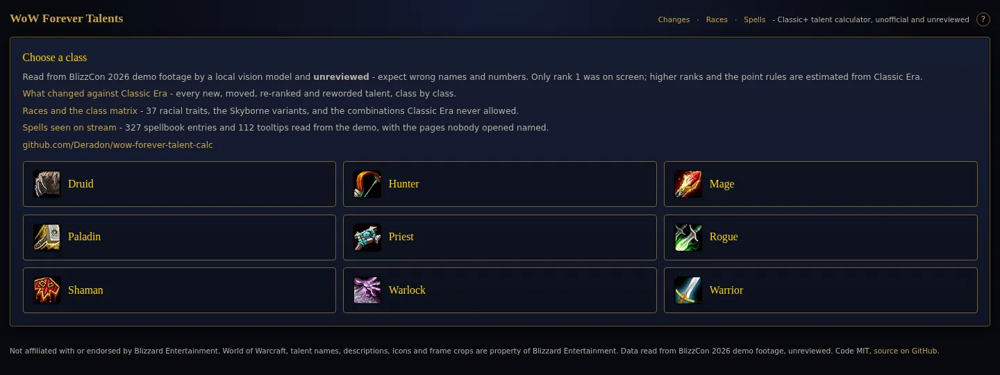
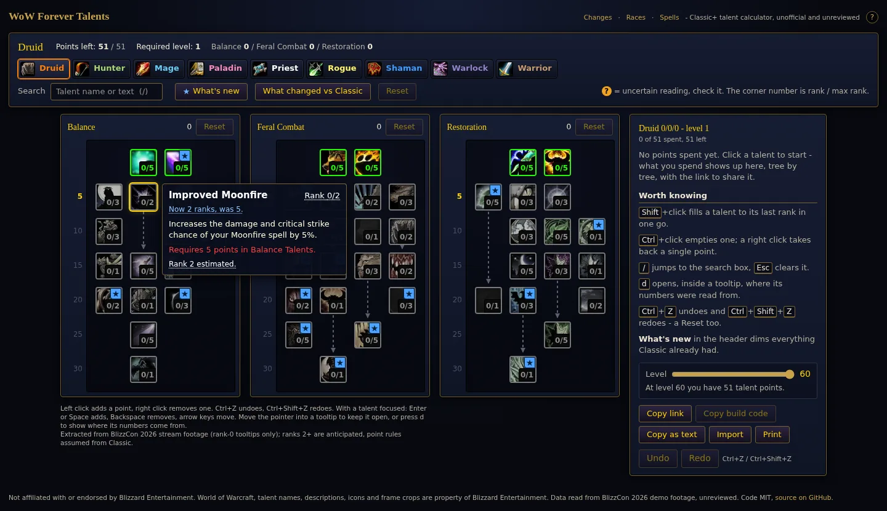
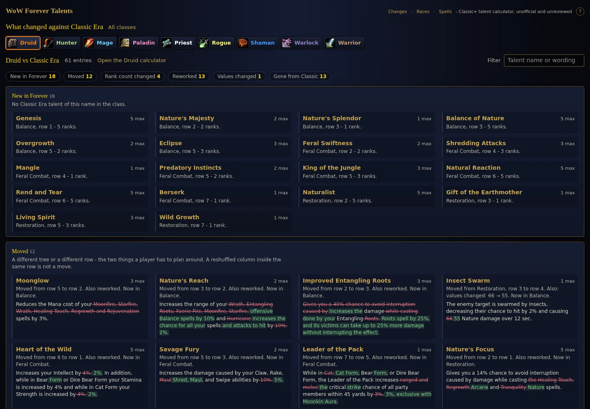
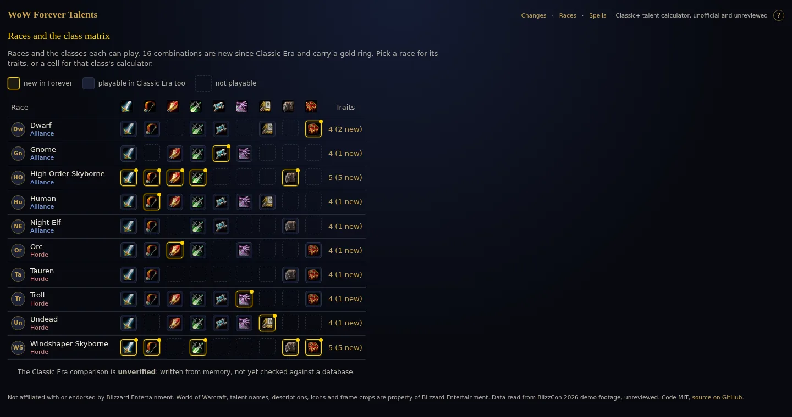

# WoW Forever Talent Calculator

A fan-made talent calculator for **World of Warcraft: Forever** (Classic+),
announced at BlizzCon 2026. The talent trees were on stream months before
anyone could log in, so this site was built from that footage: spend points,
share a build as a link, and see what changed against Classic Era.

**[deradon.github.io/wow-forever-talent-calc](https://deradon.github.io/wow-forever-talent-calc/)**
— static site, no account, no tracking, no backend.

[](https://deradon.github.io/wow-forever-talent-calc/)

## What it does

- **All nine classes**, 469 of 470 talents, with the Classic-style rules:
  51 points, five per row, prerequisite arrows, tier gating.
- **Shareable builds.** `#/warrior?v=1&t=...` is the whole build; also a short
  build code, a Discord-ready text summary, a print view and `embed=1` for
  forums. Wowhead Classic strings can be imported by talent name.
- **Honest tooltips.** Every talent says how well it was read. Open a tooltip
  and press `d` (or move into it) for where the numbers come from: the frame it
  was read from, the Classic talent its higher ranks were scaled from, and the
  second reader's wording when the two disagreed.
- **What changed vs Classic Era** — 145 new talents, 81 moved, 26 with a
  different rank count, 127 reworded and 108 gone, with an inline word diff.
- **Races** — 37 racial traits for 9 races (both Skyborne variants) and the
  race/class matrix, with the 16 combinations Classic Era never allowed.
- **The spellbook as the stream showed it** — 327 entries and 112 full
  tooltips over eight classes, with the pages nobody opened named as such.
- **Keyboard and touch**: arrow keys across the grid, shift-click to max,
  ctrl-click to clear, undo/redo, tap-to-open tooltips with +/− controls.

| A class page, tooltip pinned | What changed against Classic |
|---|---|
| [](https://deradon.github.io/wow-forever-talent-calc/#/druid) | [](https://deradon.github.io/wow-forever-talent-calc/#/changes) |

[](https://deradon.github.io/wow-forever-talent-calc/#/races)

## Where the data comes from

A local vision model read every talent tooltip out of the BlizzCon 2026 demo
stream, one hovered cell at a time, and OpenCV placed each reading in its grid
cell, matched its icon and traced the prerequisite arrows. Only rank 1 was ever
on screen, so higher ranks are scaled from the matching Classic Era talent and
the point rules are assumed to be the Classic ones. Every record keeps the
video timestamp, the frame and the reader's confidence, and nothing claims to
be official.

The honest caveats, in order of how much they should worry you:

- **Numbers are the least reliable part.** Rank 1 was read from a screenshot;
  ranks 2+ are arithmetic on a Classic scaling pattern, which is wrong wherever
  Forever retuned a talent.
- **57 of 469 records have been checked by a human**, 6 are still below the
  0.8 confidence threshold. The rest are a good draft.
- **One talent is missing** (mage, Fire, row 1 column 3): it was never hovered
  on stream.
- **The rules are assumed**: 51 points, 5 per row, first point at level 10.
  Nobody has confirmed them for Forever.
- **The Classic Era comparison is a reference dataset**, not a database dump.

## Report a wrong reading

Open **[a wrong-reading issue](https://github.com/Deradon/wow-forever-talent-calc/issues/new?template=wrong-reading.yml)**
with the talent and what it should say. The fastest route is the review page —
`#/review/<class>`, for example
[`#/review/warrior`](https://deradon.github.io/wow-forever-talent-calc/#/review/warrior) —
which shows every record beside the tooltip crop it was read from and has a
"Report on GitHub" link per row that fills the form in for you.

Fixing it yourself is one JSON entry and a pull request: `CONTRIBUTING.md`.

## Run it yourself

Requires `node` >= 22 and, for the data half, [`uv`](https://docs.astral.sh/uv/)
(Python 3.12). `ffmpeg` and `yt-dlp` are only needed to re-run the extraction
from video, which also wants an NVIDIA GPU for the local vision model.

```bash
# the site
cd web
npm install
npm run dev          # http://localhost:5173
npm test             # vitest, 542 unit tests
npm run e2e          # playwright, 80 browser tests (once: npx playwright install chromium)
npm run build        # static files in web/dist, deployable anywhere

# the data
cd pipeline
uv run pytest                                              # 461 tests
uv run python validate.py --check ../data/talents/*.json   # must exit 0
uv run stages/08_export.py --help                          # extract / promote
```

`data/talents/<class>.json` is the source of truth; the site reads nothing
else. Stage by stage: `pipeline/README.md`. Web details: `web/README.md`. The
data contract: `docs/DATA-SCHEMA.md`. Plan and history: `docs/PLAN.md`.

## License and affiliation

Code is MIT (`LICENSE`). Talent names, descriptions, icons and the frame crops
under `data/review/` are © Blizzard Entertainment and are not covered by it;
they are included as a factual reference to a publicly broadcast demo.

**Not affiliated with, endorsed by, or connected to Blizzard Entertainment.**
World of Warcraft is a trademark of Blizzard Entertainment, Inc. This is an
unofficial fan project, and its data is unofficial and partly unverified.
